# Modelos de Pronostico de Temperatura Minima en Melbourne

Dataset usado [Daily Minimum Temperatures in Melbourne](https://raw.githubusercontent.com/jbrownlee/Datasets/master/daily-min-temperatures.csv)  y más datasets en github  [jbrownlee/Datasets](https://github.com/jbrownlee/Datasets)

Se realizo para la prediccion de pronostico de temperatura minima en melbourne entrenando modelos LSTM,MLP,1D y transformers  para realizar cual de estos da resultados mejores.

<p align="justify">
El mejor modelo usado para realizar el Pronostico de Temperatura Minima en Melbourne fue LSTM segun la evaluacion del modelo
</p>

## LSTM
Evaluación del modelo LSTM
```bash
    MSE: 4.6769
    RMSE: 2.1626
    MAE: 1.7079
    MAPE: 20.7118%
    R²: 0.7221
```

<p align="center">
  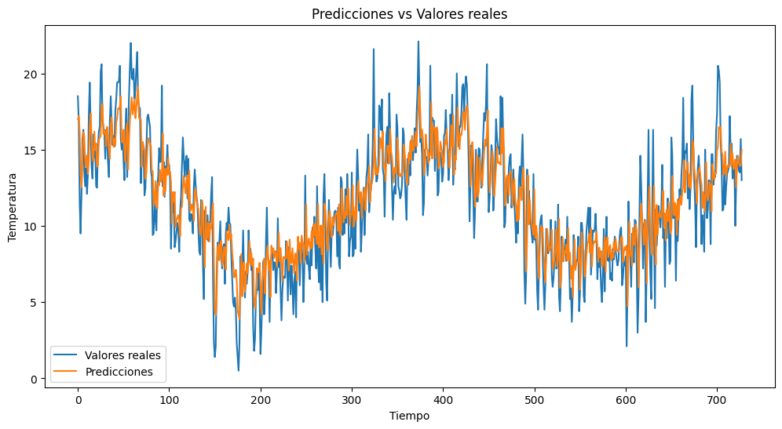
</p>


Predicción Futura LSTM
<p align="center">
  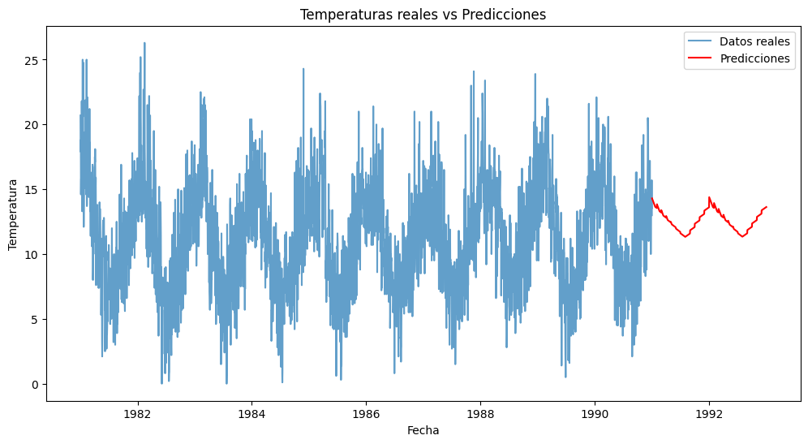
</p>

Loss  LSTM
<p align="center">
  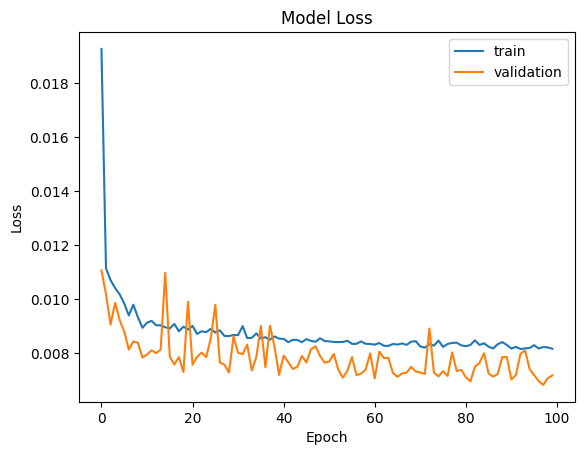
</p>

-----

## MLP
Evaluación del modelo MLP
```bash
    MSE: 7.1385
    RMSE: 2.6718
    MAE: 2.1278
    MAPE: 26.6097%
    R²: 0.5831
```

<p align="center">
  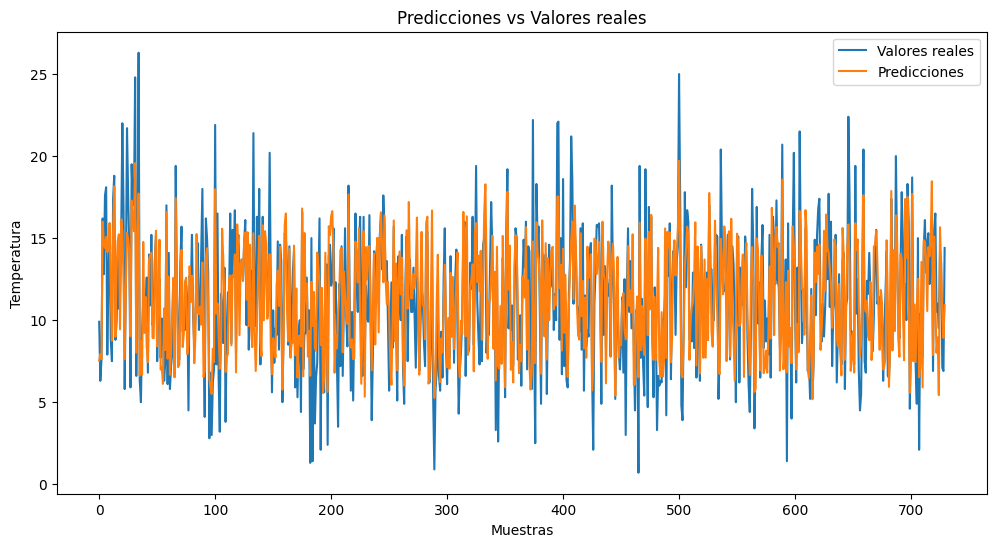
</p>


Predicción Futura MLP
<p align="center">
  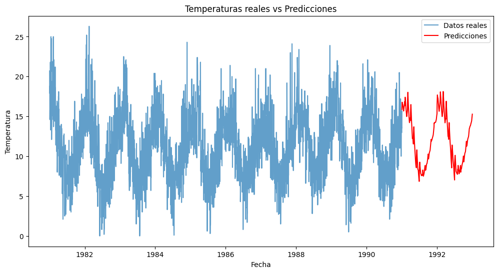
</p>

Loss  MLP
<p align="center">
  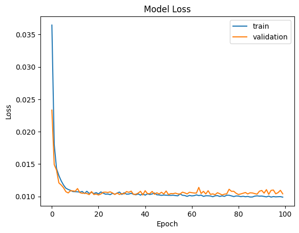
</p>

-----
## 1D
Evaluación del modelo 1D
```bash
    MSE: 5.8860
    RMSE: 2.4261
    MAE: 1.9138
    MAPE: 22.4711%
    R²: 0.6502
```

<p align="center">
  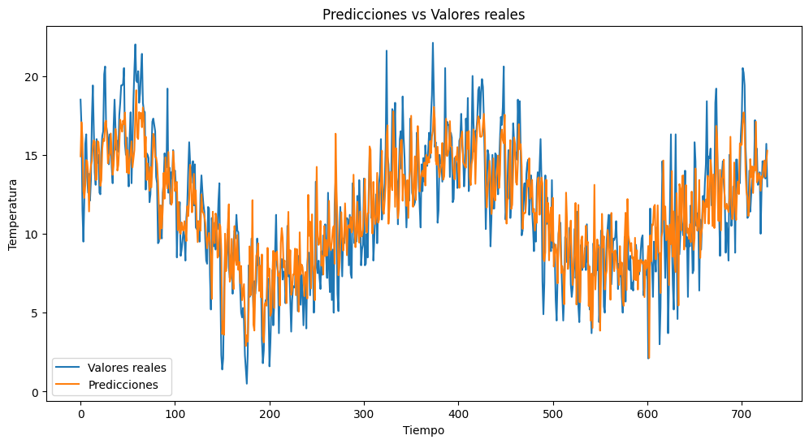
</p>


Predicción Futura 1D
<p align="center">
  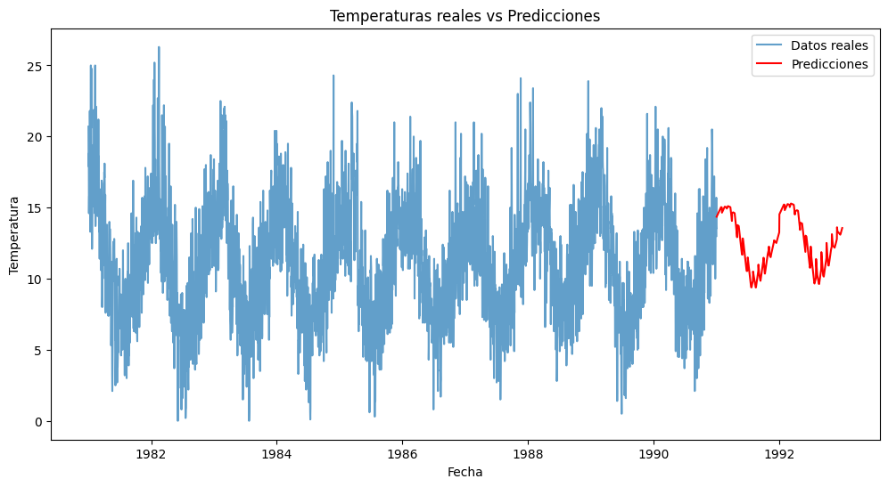
</p>

Loss  1D
<p align="center">
  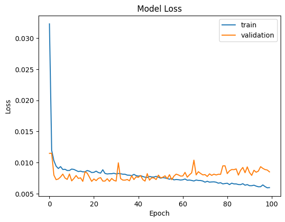
</p>


-----
## Transformers
Evaluación del modelo transformers
```bash
    MSE: 15.2983
    RMSE: 3.9113
    MAE: 3.0991
    MAPE: 40.4206%
    R²: 0.1066
```

<p align="center">
  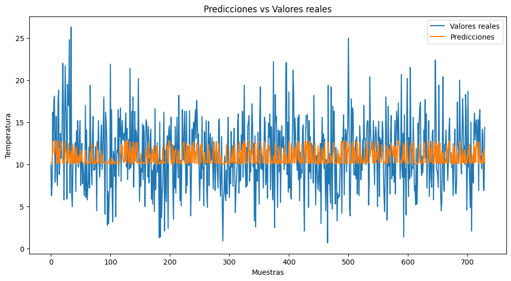
</p>


Predicción Futura transformers
<p align="center">
  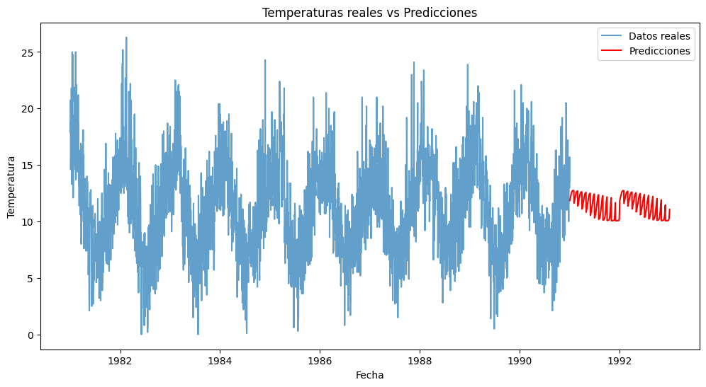
</p>

Loss  transformers
<p align="center">
  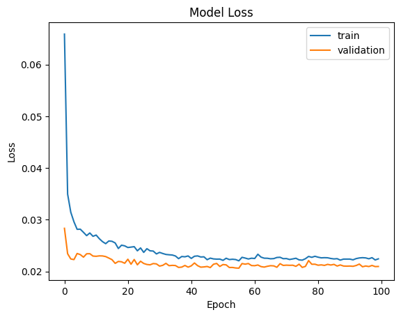
</p>